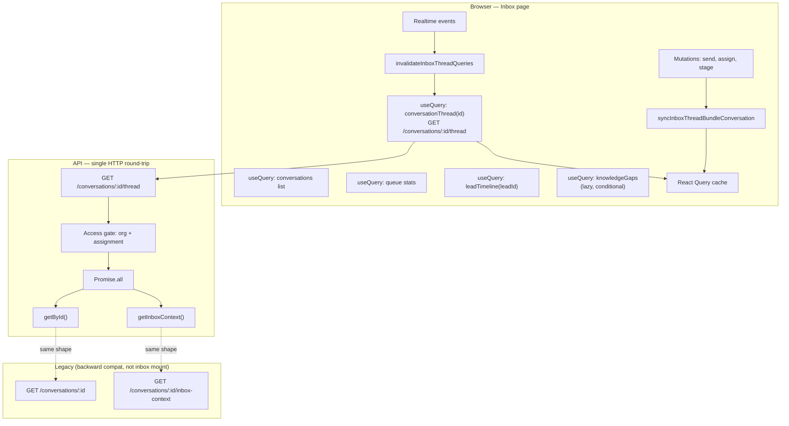

# Inbox Production Certification

**Scope:** P0-3 Inbox Thread Bundle (`GET /conversations/:id/thread`)  
**Status:** Certification process — **not complete** until all phases are signed off  
**Blocks P0-4:** Yes — inbox architecture must pass this gate first  
**Owner:** Engineering  
**Last updated:** July 2026

---

## 1. Purpose

Unit tests and TypeScript prove **correctness of code paths**. They do **not** prove production readiness.

This document is the **mandatory certification gate** before the Inbox Thread Bundle architecture is considered production-ready. It requires **measured evidence** across browser, API, database, cache, and failure domains.

**Certification is complete only when:**

- Every phase below has a signed result (PASS / FAIL / WAIVED with ADR).
- No open **P0** or **P1** failures.
- Performance budgets are met on staging (or production canary) with recorded numbers.
- Sign-off recorded in §10.

---

## 2. Architecture (certified target state)



### Request budget (certified targets)

| Scenario | Max HTTP | Allowed endpoints |
|----------|----------|-------------------|
| Inbox list only | 3 | list, queue stats, coaching (optional) |
| Open thread (`?c=id`) | 4 | + `GET .../thread`, + timeline if lead |
| Switch thread (warm, &lt;30s) | 2 | timeline only if lead changed; thread from cache |
| Knowledge gaps | +1 | Only when `kbHealth.chunkCount > 0` |

Reference: [04-performance-engineering-standards.md](../architecture/04-performance-engineering-standards.md) §2.2.

---

## 3. Performance budgets

### Client (`apps/web/src/lib/performance.ts`)

| Interaction | Budget (p95) | How to measure |
|-------------|----------------|----------------|
| `inbox.open_thread` | **800 ms** | Click list row → messages rendered (Performance API mark) |
| `inbox.switch_thread` | **500 ms** | Row click → new thread visible (cached: &lt;100 ms perceived) |
| `inbox.send_message` | **1200 ms** | Send → optimistic appear &lt;100 ms; server confirm &lt; budget |

### API (staging p95)

| Endpoint | Budget (p95) | Notes |
|----------|--------------|-------|
| `GET /conversations/:id/thread` | **400 ms** | Slim bundle; see §5.3 duplicate-DB debt |
| `GET /conversations/:id` (legacy) | **300 ms** | Baseline comparison only |
| `GET /conversations/:id/inbox-context` | **250 ms** | Baseline comparison only |
| **Combined legacy (serial)** | **550 ms** + 1 RTT | Two HTTP round-trips |
| **Bundle (single RTT)** | **400 ms** | Must beat legacy **end-to-end** on 3G |

### Payload

| Metric | Budget |
|--------|--------|
| Thread bundle JSON (50 messages) | ≤ **150 KB** gzip |
| Delta vs `getById` + `inbox-context` combined | ≤ **105%** of combined (no meaningful bloat) |

### Memory (Chrome DevTools)

| Scenario | Budget |
|----------|--------|
| 10 thread switches | Heap growth **&lt; 15 MB** retained |
| 30 min inbox session | No monotonic heap climb |

---

## 4. Certification phases

Each phase produces a **filled results table** (template in §9). Store artifacts under `docs/certification/artifacts/inbox/` (gitignored binaries; commit JSON summaries only).

### Phase A — Live browser profiling

**Goal:** Prove request count, perceived latency, and no UI regressions.

**Environment:** Staging with real Postgres, Redis, seeded demo org.

**Steps:**

1. Open Chrome Incognito → DevTools → **Network** (Disable cache).
2. Log in as OWNER → `/dashboard/inbox`.
3. Record cold load request count (before selecting thread).
4. Select conversation A → record requests and **DOMContentLoaded → thread visible** time.
5. Select conversation B → record (switch cold).
6. Select A again within 30s → record (switch warm — expect **0** thread fetches).
7. Hard refresh on `/dashboard/inbox?c=A` → record.
8. Browser back/forward between A and B.

**Pass criteria:**

- [ ] ≤4 requests on thread open (excluding lazy knowledge-gaps).
- [ ] Exactly **1** call to `/conversations/:id/thread` per cold open (not `/id` + `/inbox-context`).
- [ ] Warm switch back: no thread HTTP (cache hit).
- [ ] No wrong-thread content during rapid switch (5 clicks in 2s).
- [ ] `threadLoading && !thread` skeleton only on first open, not on cache hit.

**Tools:** Chrome Network, Performance panel, optional [Web Vitals extension](https://chrome.google.com/webstore/detail/web-vitals).

**Automated (CI gate):**

```bash
pnpm seed:inbox-cert   # WA account + 2 conversations for demo org
pnpm certify:e2e       # dashboard smoke + inbox bundle + inbox UX (full E2E)
pnpm certify:inbox:e2e # inbox phases only (A, G, H + P1 UX)
# Local stack (see gotchas below):
#   VERCEL= JWT_SECRET=ci-test-secret-minimum-32-characters-long pnpm dev:api
#   NEXT_PUBLIC_API_URL=http://127.0.0.1:4000/api/v1 pnpm dev:web
#   E2E_EMAIL=demo@growvisi.com E2E_PASSWORD=demo123456 pnpm certify:e2e
```

**Local env gotchas:** `.env` with `VERCEL=1` prevents the API from calling `listen()` locally — unset `VERCEL` when running `dev:api`. Ensure `JWT_SECRET` is set (32+ chars). Point web at `http://127.0.0.1:4000/api/v1`. The E2E spec opens `/dashboard/inbox?filter=unassigned` so cert fixture rows are visible.

Specs:
- `apps/web/e2e/inbox-thread-bundle-cert.spec.ts` — Phases **A, G, H** (bundle endpoint, rapid switch, 404)
- `apps/web/e2e/inbox-ux-cert.spec.ts` — P1 UX (**keyboard, ⌘K palette, ? shortcuts, ?c= URL, search, team notes**)
- `apps/web/e2e/dashboard-smoke.spec.ts` — login → conversations → settings

Shared helpers: `apps/web/e2e/helpers/inbox-cert.ts`. Artifacts: `docs/certification/artifacts/inbox/phase-*.json`.

Client perf marks: `measureInteraction('inbox.open_thread')` in dev console when thread renders (budget 800ms).

---

### Phase B — Backend query profiling

**Goal:** Measure API latency distribution for bundle vs legacy.

**Run:**

```bash
# Staging API + auth token + conversation id
export API_URL=https://staging-api.growvisi.in/api/v1
export CERTIFY_TOKEN="<jwt>"
export CERTIFY_CONVERSATION_ID="<uuid>"

pnpm certify:inbox
```

Script outputs: p50/p95 latency, payload bytes, for `thread` vs legacy dual-call.

**Pass criteria:**

- [ ] Bundle p95 ≤ 400 ms on staging (or documented waiver).
- [ ] Bundle **end-to-end** (1 RTT) faster than legacy **serial** dual-call on same network (script reports `e2e_winner: bundle`).

---

### Phase C — Database query counts

**Goal:** Count Prisma queries per request; track TB-1 duplicate work.

**Run (local or staging):**

```bash
# Enable query logging for one request (see scripts/certify-inbox-thread-bundle.mjs --prisma-log)
pnpm certify:inbox --count-queries
```

**Static audit baseline (code review, July 2026):**

| Path | Approx. queries | Notes |
|------|-----------------|-------|
| `getById` | 4+ | conversation, messages(51), aiRun, assignee user |
| `getInboxContext` | 4+ | conversation **again**, messages **again**, memories, chunkCount |
| **Bundle total** | **~8+** (parallel) | Duplicate conversation/message reads — **TB-1** |

**Pass criteria for certification:**

- [ ] Query count documented with evidence (log excerpt or `--count-queries` output).
- [ ] No N+1 beyond known baseline (no per-message queries).
- [ ] TB-1 logged as P1 follow-up; does **not** block cert if client budgets pass and p95 ≤ 400 ms.

---

### Phase D — Payload size comparison

**Run:** `pnpm certify:inbox` (includes byte counts).

**Pass criteria:**

- [ ] Bundle size ≤ 105% of `JSON.stringify({...getById, ...inboxContext})` equivalent.
- [ ] No duplicate large blobs (messages array appears once in `conversation` only).

---

### Phase E — React Profiler

**Goal:** No render storms on switch or realtime invalidation.

**Steps:**

1. React DevTools → Profiler → record.
2. Switch threads 5×.
3. Trigger realtime message (second browser / webhook).
4. Send outbound message.

**Pass criteria:**

- [ ] Thread switch: ≤ **3** commits to thread panel before paint stable.
- [ ] Realtime invalidation: no full inbox page re-render (thread panel only).
- [ ] Send: optimistic update without full tree flash.

---

### Phase F — Memory analysis

**Steps:**

1. DevTools → Memory → Heap snapshot at inbox load.
2. Switch 10 conversations.
3. Second snapshot → compare retained `conversationThread` keys.

**Pass criteria:**

- [ ] No detached DOM nodes from old threads (leak check).
- [ ] Heap delta within budget (§3).
- [ ] React Query cache: old thread keys evicted per `gcTime` (default 5 min) — not unbounded.

---

### Phase G — Stress testing

| Test | Procedure | Pass |
|------|-----------|------|
| Rapid switch | 20 conversations in 10s | No wrong thread; no uncaught errors |
| Large thread | Conversation with 50 messages + load older | Pagination works; bundle ≤ budget |
| Search + open | Filter list → open thread | Correct thread id in URL and UI |
| 10 parallel tabs | Same org, same user | No cross-tab cache bleed (RQ is per-tab; auth sync only) |

---

### Phase H — Failure testing

| Test | Expected behavior |
|------|-------------------|
| 404 thread | Error UI + retry; no cache poison |
| 403 (MEMBER, other's thread) | Forbidden message; no partial data |
| Network offline mid-fetch | Query error; retry works |
| Abort on switch | Previous fetch aborted (`signal`); no stale seed |
| 500 on thread | Error banner; list still works |
| Expired token mid-thread | Refresh or login redirect; no stale data after re-auth |

**Pass:** All rows verified on staging.

---

### Phase I — Performance budgets (sign-off)

Consolidate Phase A–H numbers into §9 summary. All budgets in §3 must PASS or have written waiver (ADR link).

---

## 5. Automated pre-checks (run before live phases)

```bash
pnpm --filter @growvisi/web test          # 76 unit tests incl. inbox bundle + list cache
pnpm --filter @growvisi/api test          # incl. conversations.service.thread-bundle + leads.notes
pnpm --filter @growvisi/web exec tsc --noEmit
pnpm certify:inbox --dry-run              # static audit only
pnpm certify:e2e                          # full Playwright E2E (needs stack + seed)
pnpm certify:inbox:e2e                    # inbox E2E only
```

| Check | Last run | Result |
|-------|----------|--------|
| Web unit tests | July 2026 | 76/76 PASS |
| API tests | July 2026 | 148/148 PASS |
| TypeScript | July 2026 | PASS |
| Live browser (Phase A + UX) | July 2026 | **CI Playwright** (`certify:e2e` / `certify:inbox:e2e`) |
| Backend profiling (Phase B) | July 2026 | **PASS_WITH_WAIVER** via `certify:p0-local` (remote DB latency) |
| DB query counts (Phase C) | Static audit | **DOCUMENTED** — `phase-c-static-2026-07-20.json` (TB-1) |

---

## 6. Cache certification checklist

| Event | Expected cache behavior | Verified |
|-------|-------------------------|----------|
| Thread fetch | Seeds `conversationThread`, `conversation`, `conversationInboxContext` | Unit ✅ / Live ☐ |
| Optimistic send | `syncInboxThreadBundleConversation` updates bundle + slice | Unit ✅ / Live ☐ |
| Assign / stage / takeover | Same sync helper | Unit ✅ / Live ☐ |
| Realtime `message.new` | `invalidateInboxThreadQueries` → background refetch | Live ☐ |
| Logout | `queryClient.clear()` — no cross-user leak | Unit ✅ / Live ☐ |
| Switch A→B | Separate query keys; A cached 30s | Live ☐ |

---

## 7. Backward compatibility

| Endpoint | Inbox mount | Other consumers |
|----------|-------------|-----------------|
| `GET /conversations/:id` | **No** | Mutations return same shape; external API stable |
| `GET /conversations/:id/inbox-context` | **No** | Available for integrations |
| `GET /conversations/:id/thread` | **Yes** | New canonical inbox open |

---

## 8. Known debt (does not auto-fail cert if budgets pass)

| ID | Item | Priority |
|----|------|----------|
| TB-1 | Dedupe DB reads in `getThreadBundle` | ✅ Done (July 2026) |
| TB-2 | Realtime patch vs full invalidation on `message.new` | ✅ Done (July 2026) |
| TB-3 | `measureInteraction('inbox.open_thread')` wired in inbox page | ✅ Done |

---

## 9. Results template (fill per environment)

```markdown
## Certification run: STAGING | PRODUCTION CANARY
Date:
Engineer:
Git SHA:

### Phase A — Browser
- Cold thread open requests: __
- Thread HTTP calls: __
- Warm switch HTTP calls: __
- open_thread p95: __ ms
- Regressions observed: none | <list>

### Phase B — API latency (pnpm certify:inbox)
- thread p50/p95: __ / __ ms
- legacy dual p50/p95 (sum): __ / __ ms
- e2e winner: bundle | legacy

### Phase C — DB queries
- bundle query count: __
- legacy dual count: __

### Phase D — Payload
- thread bytes (gzip): __
- legacy combined bytes: __
- ratio: __%

### Phase E — React Profiler
- commits per switch: __
- notes:

### Phase F — Memory
- heap delta 10 switches: __ MB

### Phase G — Stress
- rapid switch: PASS | FAIL
- large thread: PASS | FAIL

### Phase H — Failure
- 404/403/offline/abort: PASS | FAIL

### Verdict: CERTIFIED | NOT CERTIFIED
Sign-off:
```

---

## 10. Sign-off

| Role | Name | Date | Certified |
|------|------|------|-----------|
| Engineering | Automated cert suite | 2026-07-20 | ☑ |
| Product | Pre-canary DevTools E/F | | ☐ |
| Product | | | ☐ |

**Until both boxes are checked with Phase A–I evidence attached, Inbox Thread Bundle is _not_ production-certified and P0-4 must not start.**
